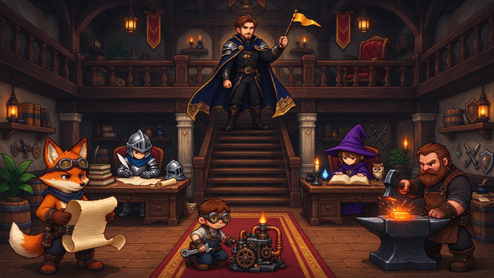
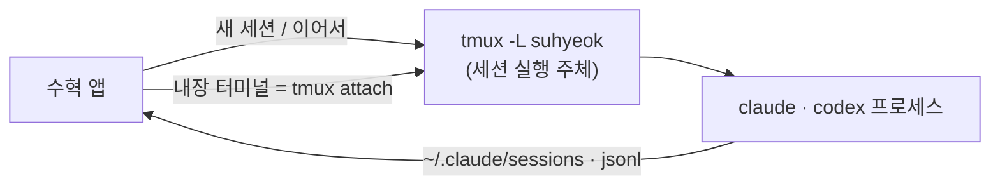
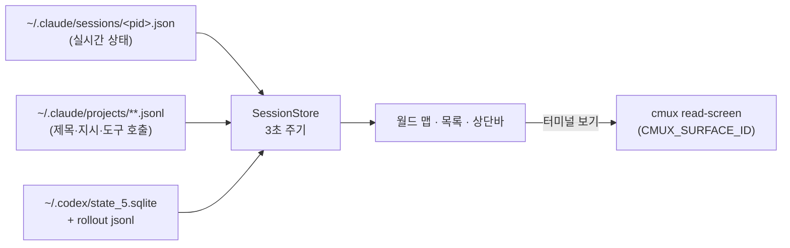

<p align="center"></p>

# 수혁 — 로컬 에이전트 세션을 한 화면에서 지휘하는 맥 앱

> **수**십 명의 에이전트가 제각각 일해도
> **혁**혁한 장수 하나가 한눈에 지휘한다

- 이름 = 帥赫(장수 수 · 빛날 혁), "빛나는 장수"
- 터미널 창마다 흩어진 Claude Code·Codex 세션을 픽셀 RPG 길드홀 한 장에 모음



## 설치

```bash
brew install oyhoyhk/tap/suhyeok   # tmux 함께 설치
suhyeok                            # 앱 실행
```

- 업데이트: 새 버전이 나오면 사이드바 아래에 "업데이트 설치" 버튼이 뜸 (실행 시·6시간마다 확인). 누르면 `brew upgrade` 후 앱 재실행, 에이전트 세션은 유지
- 0.1.1 이하 사용자: 업데이트 버튼이 없는 버전이라 한 번만 `brew upgrade suhyeok` 직접 실행
- 요구 사항: Apple Silicon 맥, macOS 14 이상, Claude Code 또는 Codex CLI
- Launchpad·Spotlight에 넣기: `ln -sf "$(brew --prefix)/opt/suhyeok/수혁.app" ~/Applications/수혁.app`

## 작업 공간 — 수혁 안에서 세션 만들고 운영

- ＋ 새 세션(⌘N) → 에이전트(Claude Code·Codex) · 작업 폴더 · 첫 지시 → 수혁 전용 tmux 서버에서 실행
- 사이드바 = 월드 · 목록 · 수혁 세션 · 다른 터미널 · 최근 대화
- 수혁 세션 = 앱 안 내장 터미널(SwiftTerm)에서 직접 조작. 키 입력 · 권한 확인 메뉴 · 단축키 모두 그대로
- 수혁을 종료·재시작해도 세션 유지 (tmux 서버가 실행 주체). 급할 때 다른 터미널에서 `tmux -L suhyeok attach -t <이름>`
- 세션 여는 방식(설정 ⌘,): **대화창(기본)** 또는 터미널
  - 대화창 = RPG NPC 대화처럼 큰 창에 일러스트 · 에이전트 답 · 내 지시를 교차로 표시. 입력 → 그 세션 터미널로 전달
  - 권한 확인·선택지 메뉴 = 빠른 키(↑ ↓ ⏎ Esc 1 2 3) + "화면 보기"로 응답
  - 월드에서 캐릭터 클릭 → "대화하기" → 맵 위에 대화창
- 마이그레이션(사이드바 "다른 터미널" → "수혁으로 옮기기…"): cmux·Orca·tmux 세션을 골라 수혁으로 이전
  - 원래 세션에 `/exit` 전송 → 종료 확인 → 수혁에서 `--resume`으로 대화 기록 전체를 이어받음
  - 작업 중인 세션은 끊지 않도록 제외. 원래 터미널에 입력할 수 없는 경우는 이어서 열기만 하고 안내
- 지시 전달 경로: tmux(`paste-buffer`, 여러 줄 유지) · cmux(`send`, 한 줄로 합침, 소켓 password 모드 필요) · Orca(`terminal send`)
- 최근 대화(7일) → "이어서" 한 번으로 수혁 세션으로 복귀
- tmux 접두키 없음(Claude Code의 ctrl+b 유지), 상태줄 숨김 — 설정 파일 `~/Library/Application Support/Suhyeok/tmux.conf`



## 한눈에 보는 기능

- 세션 1개 = 캐릭터 1명. 상태에 따라 길드홀의 다른 구역으로 걸어감
- 작업 중 캐릭터는 지금 쓰는 도구에 맞는 동작을 함 (편집=타이핑, Bash=망치질, 읽기=끄덕임)
- 호버 → 이름 · 세션 제목 · 프로젝트 · 마지막 지시
- 클릭 → 작은 상태창 → "터미널 보기"로 해당 cmux 터미널 화면을 실시간 확인
- 맥 상단바 → 깃발 아이콘 + 작업 중 수, 작업 중 에이전트 목록

## 상태와 구역

| 상태 | 조건 | 구역 | 동작 |
|---|---|---|---|
| 작업 중 | 응답 생성 중 또는 셸 실행 중 | 왼쪽 작업대 홀 | 도구별 동작 + 머리 위 아이콘 |
| 대기 중 | 응답 종료 후 10분 미만 | 가운데 선술집 | "…" 말풍선 |
| 휴식 중 | 응답 종료 후 10분 이상 | 오른쪽 라운지 | zzz |

- 휴식 전환 시간 변경: `defaults write com.pickuma.agentdeck restAfterMinutes 30`

## 데이터 흐름



- 모든 데이터는 로컬 파일에서 읽음. 네트워크 전송 없음
- Codex 세션은 레지스트리가 없어 "최근 30분 갱신"으로 추정함 (카드에 "추정" 표시)

## 실행

```bash
./build.sh            # 수혁.app 생성 (Xcode 프로젝트 불필요, Swift 5.9+ / macOS 14+)
open 수혁.app
```

- 화면 없이 확인: `수혁.app/Contents/MacOS/AgentDeck --snapshot out.png`
- 새 버전 배포(관리자): `./publish.sh 0.1.2 "변경 요약"` → 빌드 · GitHub 릴리스 · tap Formula 갱신까지 한 번에
- 업데이트 확인: `수혁.app/Contents/MacOS/AgentDeck --check-update`
- 명령줄 대화: `--send <세션ID> "지시"` · `--press <세션ID> escape` · `--migrate <세션ID>` · `--snapshot-dialogue <세션ID> out.png`
- 명령줄 세션 관리: `--new-session <Claude|Codex> <폴더> [지시]` · `--list-sessions` · `--kill-session <이름>` · `--snapshot-hosted <이름> out.png`

## 터미널 보기 — 어떤 터미널이든 동작

- 상태창 "터미널 보기" → [터미널 | 대화 기록] 전환
- 터미널 화면 읽기: 에이전트 프로세스 환경변수로 호스트를 판별함

| 호스트 | 판별 변수 | 읽기 명령 |
|---|---|---|
| tmux | `TMUX`, `TMUX_PANE` | `tmux -S <소켓> capture-pane` |
| Orca | `ORCA_TERMINAL_HANDLE` | `orca terminal read --terminal` |
| cmux | `CMUX_WORKSPACE_ID`, `CMUX_SURFACE_ID` | `cmux read-screen` |

- 판별 순서: tmux → Orca → cmux (cmux 안의 tmux는 tmux 화면이 더 정확함)
- 화면 읽기 API가 없는 터미널(Ghostty 단독, xterm, Alacritty, Warp, VS Code·Zed 내장)은 대화 기록으로 자동 전환
- 대화 기록 = Claude jsonl · Codex rollout의 지시 · 응답 · 도구 호출 · 결과(6줄 요약). 터미널과 무관하게 항상 동작
- cmux 전제: `automation.socketControlMode`를 `password`로 설정 후 cmux 1회 재시작. 확인 `cmux capabilities | grep access_mode`
- 화면 없이 확인: `수혁.app/Contents/MacOS/AgentDeck --terminal <세션ID> [transcript]`

## 아트

- 캐릭터 32명(스프라이트 + 일러스트), 맵, 아이콘 = Higgsfield 생성 (seedream_5_0_flash, 맵은 z_image)
- 로스터 `art/roster.json` → 생성 `art/gen.py` → 배경 제거·축소 `art/process.py` → 아이콘·파비콘 `art/brand.py`
